# 智能书店系统 - 业务逻辑文档

> 本文档梳理了书店系统各模块的核心业务思路、关键流程与设计决策。

---

## 目录

1. [用户认证 (Auth)](#1-用户认证-auth)
2. [用户管理 (User)](#2-用户管理-user)
3. [地址管理 (Address)](#3-地址管理-address)
4. [图书 / 分类 (Book / Category)](#4-图书--分类-book--category)
5. [购物车 (CartItem)](#5-购物车-cartitem)
6. [订单 (Order)](#6-订单-order)
7. [优惠券 (Coupon)](#7-优惠券-coupon)
8. [秒杀 (Seckill)](#8-秒杀-seckill)
9. [钱包 (Wallet)](#9-钱包-wallet)
10. [收藏 (Favorite)](#10-收藏-favorite)
11. [评价 (Review)](#11-评价-review)
12. [AI 智能助手 (AI Chat)](#12-ai-智能助手-ai-chat)
13. [签到 (Checkin)](#13-签到-checkin)
14. [管理员后台 (Admin)](#14-管理员后台-admin)
15. [OSS 文件上传](#15-oss-文件上传)
16. [操作日志 (OperationLog)](#16-操作日志-operationlog)
17. [搜索历史 (SearchHistory)](#17-搜索历史-searchhistory)
18. [图书推荐 (BookRecommendation)](#18-图书推荐-bookrecommendation)
19. [Token 黑名单 (TokenBlacklist)](#19-token-黑名单-tokenblacklist)

---

## 1. 用户认证 (Auth)

### 核心思路
基于 JWT 的双 Token 认证机制（Access Token + Refresh Token），Access Token 短期有效用于接口访问，Refresh Token 长期有效用于续期。

### 关键流程

| 功能 | 流程 |
|------|------|
| **注册** | 校验用户名/手机号唯一性 -> BCrypt 加密密码 -> 插入用户 -> 签发 Access + Refresh Token |
| **登录** | 支持用户名或手机号登录 -> 校验账号状态 -> 校验密码 -> 签发 Token 对 |
| **刷新 Token** | 解析 Refresh Token（必须 type=refresh）-> 查黑名单 -> 旧 Refresh 加入黑名单 -> 签发新 Token 对 |
| **登出** | 将当前 Access Token 的 jti 加入 Redis 黑名单，有效期为 Token 剩余存活时间 |

### 流程图

#### 注册流程
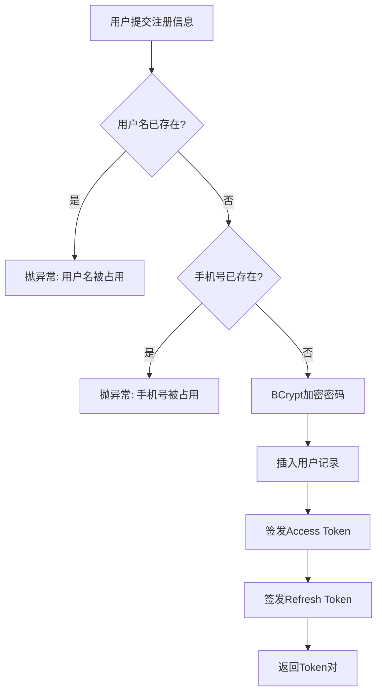

#### 登录流程
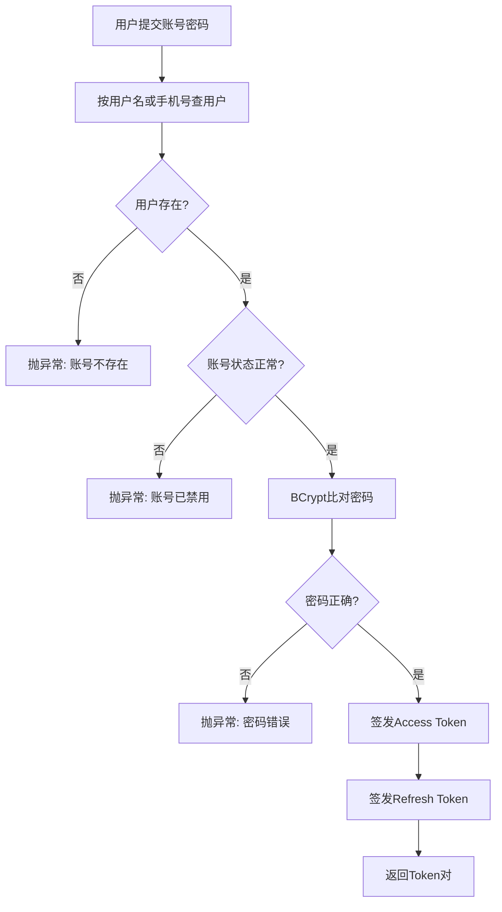

#### Token刷新流程
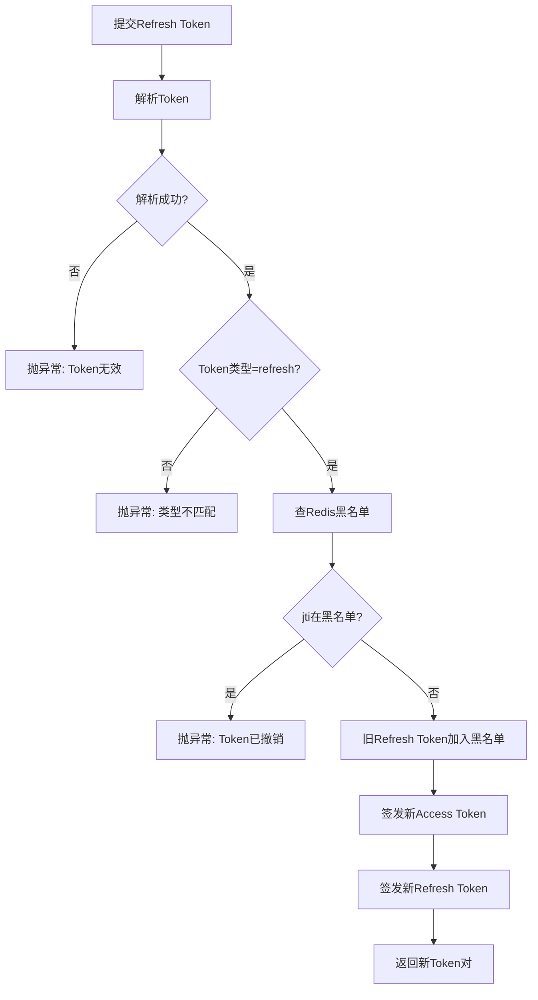

### 核心代码

**Redis Set 双写 + DB 兜底**
```java
public void addFavorite(Long userId, Long bookId) {
    // 先写 DB
    favoriteMapper.insert(f);
    // 再写 Redis Set（异步缓存，失败不影响主流程）
    try {
        RSet<Long> set = redissonClient.getSet("favorite:user:" + userId);
        set.add(bookId);
    } catch (Exception e) {
        log.warn("Redis favorite add failed", e);
    }
}

public boolean isFavorited(Long userId, Long bookId) {
    // 先查 Redis
    try {
        RSet<Long> set = redissonClient.getSet("favorite:user:" + userId);
        if (set.contains(bookId)) return true;
    } catch (Exception e) {
        log.warn("Redis favorite check failed, fallback to DB", e);
    }
    // 缓存穿透回查 DB
    return favoriteMapper.selectCount(
        new LambdaQueryWrapper<Favorite>()
            .eq(Favorite::getUserId, userId)
            .eq(Favorite::getBookId, bookId)
            .eq(Favorite::getDeleted, 0)
    ) > 0;
}
```
- Refresh Token 只能用于刷新，Access Token 只能用于访问，防止 Token 类型混淆攻击。
- 密码使用 BCrypt 加盐哈希，不可反解。

### 核心代码

**Token 黑名单（Redis 精确过期）**
```java
@Service
@RequiredArgsConstructor
public class TokenBlacklistServiceImpl implements TokenBlacklistService {
    private static final String PREFIX = "blacklist:";
    private final StringRedisTemplate redis;

    public void revoke(String jti, long expiresAtEpochMs) {
        long remaining = expiresAtEpochMs - Instant.now().toEpochMilli();
        if (remaining <= 0) return;
        redis.opsForValue().set(PREFIX + jti, "1", Duration.ofMillis(remaining));
    }

    public boolean isRevoked(String jti) {
        return Boolean.TRUE.equals(redis.hasKey(PREFIX + jti));
    }
}
```

**刷新 Token（旧 Token 加入黑名单）**
```java
public TokenVO refresh(RefreshTokenDTO dto) {
    JwtUtil.UserClaims claims = jwtUtil.parse(dto.getRefreshToken());
    String type = jwtUtil.getTokenType(dto.getRefreshToken());
    if (!"refresh".equals(type)) {
        throw new BusinessException(ResultCode.TOKEN_TYPE_MISMATCH);
    }
    if (blacklist.isRevoked(claims.jti())) {
        throw new BusinessException(ResultCode.TOKEN_INVALID);
    }
    // 将旧 Refresh Token 加入黑名单，防止重用
    blacklist.revoke(claims.jti(), claims.expiresAtEpochMs());
    return buildTokenVO(user);
}
```

---

## 2. 用户管理 (User)

### 核心思路
用户资料 CURD + 安全脱敏展示。

### 关键流程
- **查资料**：返回用户信息，手机号做掩码处理（如 `138****1234`）。
- **修改资料**：只更新传入的字段（nickname、gender、birthday），未传字段保持原值。
- **修改密码**：校验旧密码 -> 新密码不能与旧密码相同 -> BCrypt 加密更新。
- **修改头像**：更新 `avatarKey`，返回时拼接 OSS 前缀生成完整 URL。

---

## 3. 地址管理 (Address)

### 核心思路
用户收货地址的 CRUD，带默认地址自动切换逻辑。

### 关键流程

| 场景 | 行为 |
|------|------|
| **新增地址** | 若用户之前无地址，或主动设为默认，则设为默认并取消其他地址的默认状态 |
| **删除默认地址** | 自动将最新添加的其他地址提升为默认 |
| **修改地址** | 若设置为默认，则触发默认地址切换 |
| **列表查询** | 按默认状态降序排列，默认地址始终在最前 |

### 设计亮点
- 只有一个默认地址，通过 `unsetOtherDefaults` 批量更新实现原子切换。

---

## 4. 图书 / 分类 (Book / Category)

### 4.1 图书模块

#### 核心思路
图书的发布、检索、详情展示，带 Spring Cache 缓存和 MySQL 全文搜索。

#### 关键流程

| 功能 | 说明 |
|------|------|
| **列表查询** | 支持按分类、关键词（标题/作者/出版社）、价格区间筛选；支持按价格/销量/评分排序 |
| **全文搜索** | 用 `MATCH(title, subtitle, author) AGAINST` 做布尔模式全文检索；失败时降级为 LIKE 模糊查询 |
| **详情** | 缓存 `book:detail:{id}`；同时返回 4 本同分类热销图书作为关联推荐 |
| **热销/新书** | 缓存 `book:hot` 和 `book:new`，分别按销量和出版日期取 Top N |
| **图书管理** | 创建时 ISBN 唯一校验（支持恢复逻辑删除的图书）；更新/删除时清除相关缓存 |
| **库存调整** | 直接增减库存，不允许为负数 |

#### 设计亮点
- 搜索关键词长度 < 2 时直接走 LIKE 查询，避免全文索引开销。
- 缓存粒度细：详情单条缓存、热销/新书列表缓存。

### 4.2 分类模块

#### 核心思路
树形分类结构，内存中组装父子关系。

#### 关键流程
- 查询时一次性查出所有启用状态分类，在内存中按 `parentId` 组装为树。
- 删除分类前校验是否有子分类，防止误删。
- 分类树缓存 `category:tree`，增删改时全部清除。

### 核心代码

**MySQL 全文搜索（失败降级 LIKE）**
```java
public PageResult<BookListVO> search(String keyword, Integer page, Integer size) {
    String kw = keyword.trim();
    if (kw.length() < 2) {
        return list(simpleQuery(kw, page, size));  // 短词直接走 LIKE
    }
    try {
        List<Book> rows = bookMapper.selectList(
            new LambdaQueryWrapper<Book>()
                .apply("MATCH(title, subtitle, author) AGAINST({0} IN BOOLEAN MODE)", kw)
                .eq(Book::getStatus, 1)
                .eq(Book::getDeleted, 0)
                .orderByDesc(Book::getId)
        );
        if (rows.isEmpty()) {
            return list(simpleQuery(kw, page, size));  // 全文无结果降级 LIKE
        }
        List<BookListVO> vos = rows.stream()
            .map(this::toListVO).collect(Collectors.toList());
        return manualPage(vos, page, size);
    } catch (Exception e) {
        return list(simpleQuery(kw, page, size));  // 异常降级 LIKE
    }
}
```

**ISBN 唯一校验（支持恢复逻辑删除）**
```java
@Transactional
@CacheEvict(cacheNames = {"book:hot", "book:new"}, allEntries = true)
public BookVO create(BookFormDTO dto) {
    Book existing = bookMapper.selectByIsbn(dto.getIsbn());
    if (existing != null) {
        if (existing.getDeleted() == 0) {
            throw new BusinessException(ResultCode.BIZ_ERROR, "ISBN 已存在");
        }
        // 恢复已逻辑删除的书籍并更新字段
        existing.setDeleted(0);
        existing.setTitle(dto.getTitle());
        existing.setAuthor(dto.getAuthor());
        // ... 其他字段
        bookMapper.updateById(existing);
        return toVO(existing);
    }
    Book b = fromFormDTO(dto);
    bookMapper.insert(b);
    return toVO(b);
}
```

---

## 5. 购物车 (CartItem)

### 核心思路
用户购物车条目管理，支持合并同款商品。

### 关键流程

| 功能 | 说明 |
|------|------|
| **加入购物车** | 查询是否已有同款商品 -> 有则累加数量（校验库存上限）-> 无则插入新记录 |
| **并发安全** | 使用 try-catch 捕获 `DuplicateKeyException`，对并发重复插入做恢复处理 |
| **修改数量** | 校验库存是否足够 |
| **选中/取消** | 更新 `selected` 字段 |
| **清空** | 删除用户所有购物车条目 |

### 加入购物车流程图
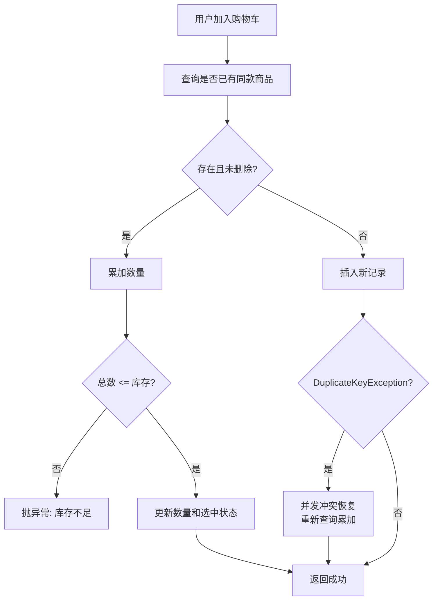

### 设计亮点
- 购物车条目采用逻辑删除，恢复时直接更新数量和选中状态，避免重复记录。

### 核心代码

**加入购物车（合并同款 + 并发恢复）**
```java
public CartItemVO addToCart(Long userId, CartItemFormDTO dto) {
    // 先查询是否存在
    CartItem exist = cartItemMapper.selectOne(
        new LambdaQueryWrapper<CartItem>()
            .eq(CartItem::getUserId, userId)
            .eq(CartItem::getBookId, dto.getBookId())
            .eq(CartItem::getDeleted, 0)
    );
    if (exist != null) {
        int newQty = exist.getQuantity() + dto.getQuantity();
        if (newQty > book.getStock()) {
            throw new BusinessException(ResultCode.STOCK_INSUFFICIENT);
        }
        exist.setQuantity(newQty);
        exist.setSelected(1);
        cartItemMapper.updateById(exist);
        return toVO(exist, book);
    }

    // 不存在则插入，捕获并发重复键异常做恢复
    try {
        CartItem item = new CartItem();
        item.setUserId(userId);
        item.setBookId(dto.getBookId());
        item.setQuantity(dto.getQuantity());
        item.setSelected(1);
        cartItemMapper.insert(item);
        return toVO(item, book);
    } catch (DuplicateKeyException e) {
        CartItem retryItem = cartItemMapper.selectOneIgnoreDeleted(userId, dto.getBookId());
        if (retryItem != null) {
            int newQty = retryItem.getQuantity() + dto.getQuantity();
            cartItemMapper.updateIgnoreDeleted(retryItem.getId(), newQty, 1);
            retryItem.setQuantity(newQty);
            retryItem.setSelected(1);
            retryItem.setDeleted(0);
            return toVO(retryItem, book);
        }
        throw e;
    }
}
```

---

## 6. 订单 (Order)

### 核心思路
从购物车到支付的完整订单生命周期，支持优惠券抵扣和库存预扣。

### 6.1 下单流程
1. 校验购物车条目归属和有效性（条目必须属于当前用户且未删除）。
2. 校验收货地址存在且属于当前用户。
3. **库存预扣**：用 `UPDATE ... WHERE stock >= qty` 的乐观锁方式扣减库存、增加销量；若 affected=0 则库存不足。
4. **优惠券处理**：若有优惠券，调用 `lockForOrder` 将其状态改为 LOCKED，锁定到当前订单。
5. 计算优惠金额和应付金额（最低 0.01 元）。
6. 生成订单号：`yyyyMMddHHmmss + 6位Redis自增序列`。
7. 地址信息做 JSON 快照存入订单（防止地址后续修改影响历史订单）。
8. 插入订单明细，删除对应购物车条目。

### 6.2 支付流程
1. 调用钱包服务扣减余额。
2. 用乐观锁将订单状态从 PENDING -> PAID。
3. 优惠券状态从 LOCKED -> USED。

### 6.3 取消流程
1. 只有 PENDING 状态可取消。
2. **库存回滚**：将图书库存和销量恢复。
3. 优惠券状态从 LOCKED -> UNUSED（释放）。
4. 订单状态改为 CANCELLED。

### 6.4 订单超时
- `PendingOrderTimeoutTask` 定时任务扫描超时的待支付订单自动取消。

### 流程图

#### 下单流程
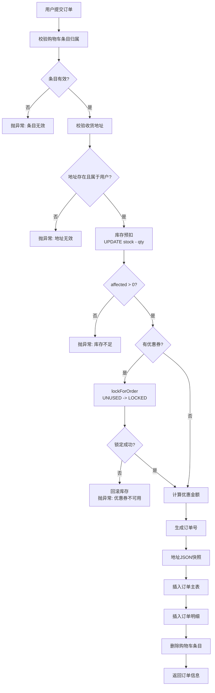

#### 支付流程
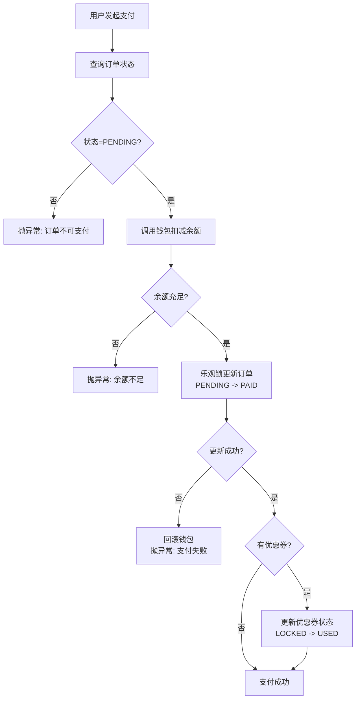

#### 取消流程
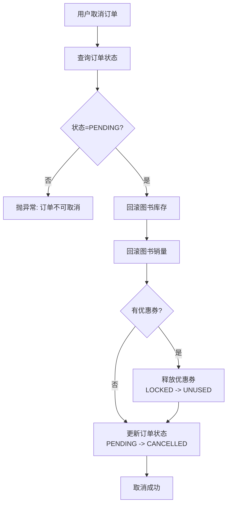

### 设计亮点
- 所有状态变更均使用乐观锁（`WHERE status = xxx`），防止并发下的状态错乱。
- 地址快照保证历史订单的地址信息不变。

### 核心代码

**库存预扣（乐观锁）**
```java
int affected = bookMapper.update(null,
    new LambdaUpdateWrapper<Book>()
        .eq(Book::getId, book.getId())
        .ge(Book::getStock, item.getQuantity())
        .setSql("stock = stock - " + item.getQuantity())
        .setSql("sales_count = sales_count + " + item.getQuantity())
);
if (affected == 0) {
    throw new BusinessException(ResultCode.STOCK_INSUFFICIENT,
        String.format("《%s》库存不足", book.getTitle()));
}
```

**支付（乐观锁状态变更）**
```java
walletService.pay(userId, orderNo, order.getPayAmount());

int affected = orderMainMapper.update(null,
    new LambdaUpdateWrapper<OrderMain>()
        .eq(OrderMain::getId, order.getId())
        .eq(OrderMain::getStatus, ORDER_STATUS_PENDING)
        .set(OrderMain::getStatus, ORDER_STATUS_PAID)
        .set(OrderMain::getPayMethod, "BALANCE")
        .set(OrderMain::getPayTime, LocalDateTime.now())
);
if (affected == 0) {
    throw new BusinessException(ResultCode.ORDER_STATUS_INVALID);
}
```

**取消（库存回滚 + 释放优惠券）**
```java
for (OrderItem oi : items) {
    bookMapper.update(null,
        new LambdaUpdateWrapper<Book>()
            .eq(Book::getId, oi.getBookId())
            .setSql("stock = stock + " + oi.getQuantity())
            .setSql("sales_count = sales_count - " + oi.getQuantity())
    );
}
int affected = orderMainMapper.update(null,
    new LambdaUpdateWrapper<OrderMain>()
        .eq(OrderMain::getId, order.getId())
        .eq(OrderMain::getStatus, ORDER_STATUS_PENDING)
        .set(OrderMain::getStatus, ORDER_STATUS_CANCELLED)
);
if (order.getCouponId() != null) {
    userCouponService.releaseForOrder(userId, order.getCouponId(), orderNo);
}
```

---

## 7. 优惠券 (Coupon)

### 7.1 优惠券模板 (CouponTemplate)

#### 核心思路
模板定义优惠券规则，发放时从模板生成用户券。

#### 优惠券类型
- `FULL_REDUCE`：满减（如满 100 减 20）
- `DISCOUNT`：折扣（如 8 折）
- `AMOUNT`：无门槛直减

#### 生命周期
READY -> RUNNING -> ENDED

| 阶段 | 说明 |
|------|------|
| **创建** | 初始状态 READY，不可编辑已发布/已结束模板 |
| **发布** | 将库存数量写入 Redis Semaphore（信号量），用于并发限流抢券 |
| **结束** | 清除 Redis 库存信号量 |
| **领取** | 用户端展示 RUNNING 且有效期内的模板，每人限领一张 |

#### 库存一致性
Redis Semaphore 用于高并发抢券限流，DB 的 `claimed_count` 用于最终统计。若 Redis 被重置，会从 DB 重新初始化。

### 7.2 用户优惠券 (UserCoupon)

#### 核心思路
用户领取的优惠券有独立生命周期：UNUSED -> LOCKED -> USED / EXPIRED。

| 状态 | 说明 |
|------|------|
| **UNUSED** | 未使用，可用于下单 |
| **LOCKED** | 已被某订单锁定（下单时占用，防止并发重复使用）|
| **USED** | 订单支付成功后确认使用 |
| **EXPIRED** | 超过有效期自动失效 |

#### 关键流程
- **领取优惠券**：用 Redis Semaphore 控制并发库存，每人每模板限领一张。
- **锁定优惠券**：用 Redisson 分布式锁防止竞态，状态从 UNUSED -> LOCKED，记录订单号。
- **使用优惠券**：分布式锁下校验 LOCKED 且订单号匹配，状态 -> USED。
- **释放优惠券**：取消订单时状态从 LOCKED -> UNUSED。

#### 定时任务
- 每 15 分钟释放卡死超过 24 小时的 LOCKED 优惠券。
- 每 30 分钟将过期优惠券标记为 EXPIRED。

#### 领取优惠券流程
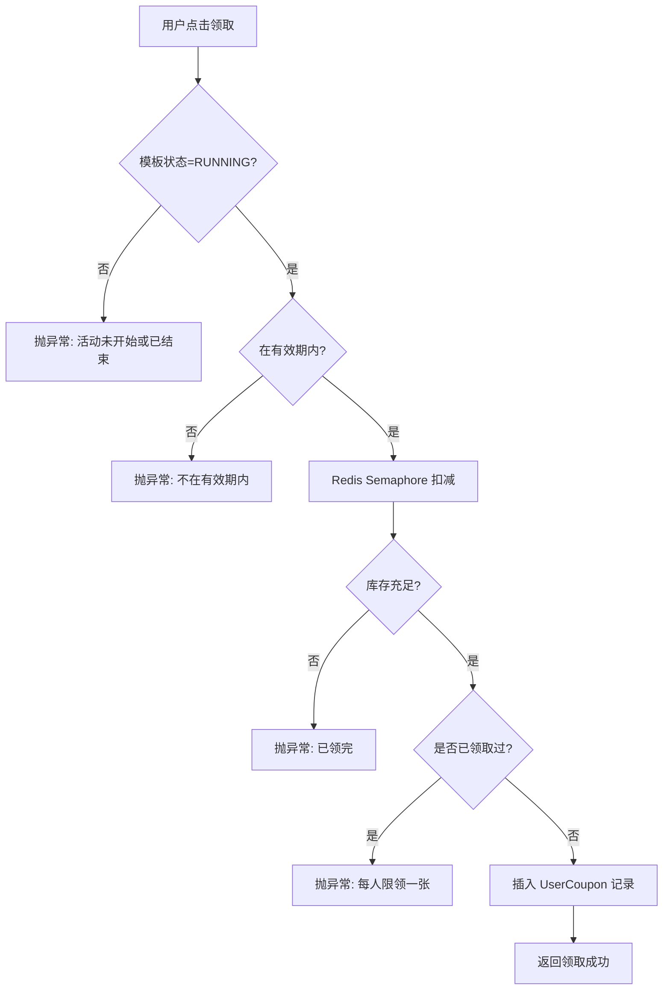

#### 优惠券生命周期流程
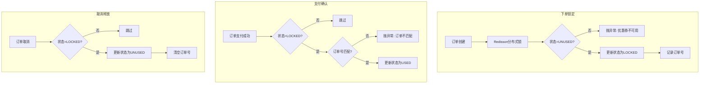

### 7.3 优惠券计算 (CouponCalculator)

- `calcDiscount`：根据模板类型计算实际优惠金额。
- `findBest`：遍历用户所有可用优惠券，自动推荐优惠力度最大的一张。
- 折扣券计算时保证优惠金额不超过 `总金额 - 0.01`。

### 核心代码

**领取优惠券（Redis Semaphore 限流 + DB 兜底）**
```java
public ClaimResultVO claim(Long userId, Long templateId) {
    RSemaphore semaphore = redissonClient.getSemaphore(
        "coupon:stock:" + templateId);
    boolean acquired;
    try {
        acquired = semaphore.tryAcquire(1, 200, TimeUnit.MILLISECONDS);
        // Redis 被重置时，从 DB 重新初始化
        if (!acquired) {
            int dbRemaining = Math.max(0, t.getTotalCount() - t.getClaimedCount());
            if (dbRemaining > 0) {
                semaphore.trySetPermits(dbRemaining);
                acquired = semaphore.tryAcquire(1, 200, TimeUnit.MILLISECONDS);
            }
        }
    } catch (InterruptedException e) {
        Thread.currentThread().interrupt();
        throw new BusinessException(ResultCode.COUPON_OUT_OF_STOCK);
    }
    if (!acquired) {
        throw new BusinessException(ResultCode.COUPON_OUT_OF_STOCK);
    }

    try {
        UserCoupon uc = new UserCoupon();
        uc.setUserId(userId);
        uc.setTemplateId(templateId);
        uc.setStatus("UNUSED");
        userCouponMapper.insert(uc);
        couponTemplateMapper.update(null,
            new LambdaUpdateWrapper<CouponTemplate>()
                .eq(CouponTemplate::getId, templateId)
                .setSql("claimed_count = claimed_count + 1")
        );
        return vo;
    } catch (RuntimeException e) {
        try { semaphore.release(); } catch (Exception ignore) {}
        throw e;
    }
}
```

**优惠券锁定（Redisson 分布式锁 + 乐观锁状态变更）**
```java
public UserCoupon lockForOrder(Long userId, Long userCouponId, String orderNo) {
    RLock lock = redissonClient.getLock("user_coupon:" + userCouponId);
    boolean locked;
    try {
        locked = lock.tryLock(3, 10, TimeUnit.SECONDS);
    } catch (InterruptedException e) {
        Thread.currentThread().interrupt();
        throw new BusinessException(ResultCode.COUPON_LOCKED_BY_OTHER);
    }
    if (!locked) {
        throw new BusinessException(ResultCode.COUPON_LOCKED_BY_OTHER);
    }
    try {
        int affected = userCouponMapper.update(null,
            new LambdaUpdateWrapper<UserCoupon>()
                .eq(UserCoupon::getId, userCouponId)
                .eq(UserCoupon::getStatus, "UNUSED")
                .set(UserCoupon::getStatus, "LOCKED")
                .set(UserCoupon::getLockedOrderNo, orderNo)
        );
        if (affected == 0) {
            throw new BusinessException(ResultCode.COUPON_NOT_USABLE);
        }
        return uc;
    } finally {
        if (lock.isHeldByCurrentThread()) lock.unlock();
    }
}
```

---

## 8. 秒杀 (Seckill)

### 8.1 秒杀活动 (SeckillActivity)

#### 核心思路
将热门商品以限时低价售卖，通过 Redis 做库存扣减和用户限购控制。

#### 生命周期
READY -> RUNNING -> ENDED（定时任务每分钟自动结束过期活动）

| 功能 | 说明 |
|------|------|
| **创建** | 绑定图书、设置秒杀价、库存、每人限购数、起止时间 |
| **开始** | 将库存写入 Redis AtomicLong，设置 TTL（活动结束后 1 小时）|
| **列表** | 缓存 `seckill:running` 和 `seckill:upcoming`，展示进行中和即将开始的活动 |

### 8.2 秒杀下单 (SeckillService)

#### 核心流程
1. 校验活动状态和时间窗口。
2. **Redis Lua 脚本原子扣库存**：
   - 检查用户是否已达每人限购上限。
   - 检查 Redis 库存是否 > 0。
   - 扣减库存、记录用户已购数量。
3. Lua 返回码：-1=超限购，-2=活动未启动，0=售罄，1=成功。
4. 扣库存成功后，在事务中扣减图书库存、创建秒杀订单、增加活动销量。
5. 如果后续创建订单失败，Redis 库存和用户已购数量回滚。

#### 秒杀订单
- 订单 5 分钟内未支付自动过期（定时任务每 30 秒扫描）。
- 支付使用钱包余额。
- 取消/过期时回滚图书库存、活动销量、Redis 状态。

### 8.3 秒杀队列 (SeckillQueueService)

#### 核心思路
应对极高并发时的削峰填谷。

#### 关键流程
1. 用户请求先通过 Lua 脚本扣 Redis 库存。
2. 扣减成功后，将请求序列化为 JSON 推入 Redis List 队列。
3. 后台消费者（SeckillQueueConsumer 定时任务）从队列中逐个取出请求，异步创建订单。
4. 每个请求有独立 requestId，用户可轮询查询处理状态（PROCESSING / SUCCESS / FAILED）。
5. 消费者处理失败时回滚 Redis 状态。

### 流程图

#### 秒杀下单流程（Lua 原子扣减）
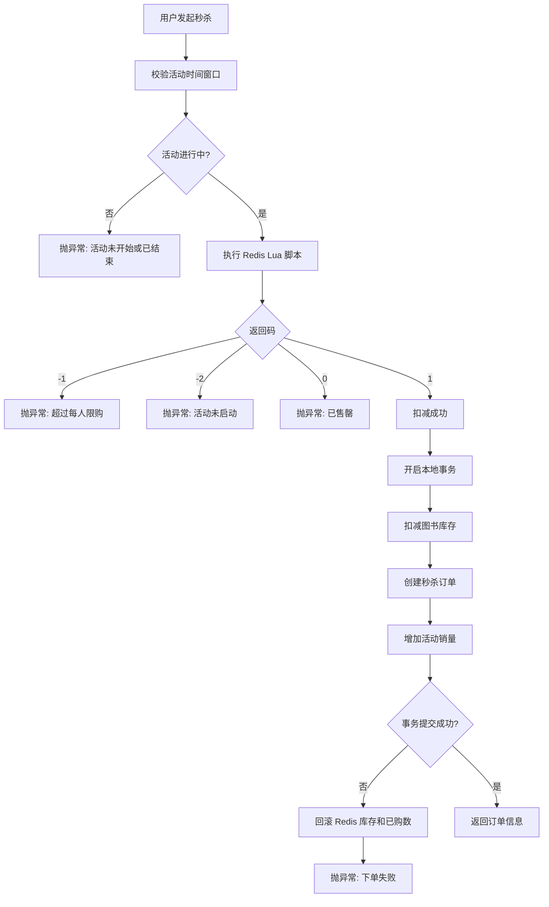

#### 秒杀队列削峰流程
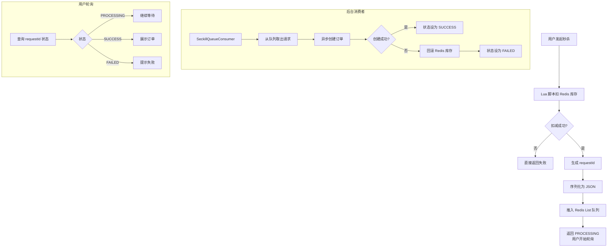

### 设计亮点
- Lua 脚本保证库存扣减和限购计数的原子性，避免并发超卖。
- 队列模式将同步压力转为异步处理，提升系统吞吐量。

### 核心代码

**Lua 原子扣减脚本**
```java
private static final String SECKILL_LUA = 
    "local stockKey = KEYS[1]\n" +
    "local boughtKey = KEYS[2]\n" +
    "local userId = ARGV[1]\n" +
    "local limit = tonumber(ARGV[2])\n" +
    "local bought = tonumber(redis.call('HGET', boughtKey, userId) or '0')\n" +
    "if bought >= limit then\n" +
    "    return -1\n" +
    "end\n" +
    "local stock = redis.call('GET', stockKey)\n" +
    "if not stock then\n" +
    "    return -2\n" +
    "end\n" +
    "if tonumber(stock) <= 0 then\n" +
    "    return 0\n" +
    "end\n" +
    "redis.call('DECR', stockKey)\n" +
    "redis.call('HINCRBY', boughtKey, userId, 1)\n" +
    "return 1";

// 执行
Long result = redissonClient.getScript(LongCodec.INSTANCE).eval(
    RScript.Mode.READ_WRITE,
    SECKILL_LUA,
    RScript.ReturnType.INTEGER,
    Arrays.asList(stockKey, boughtKey),
    String.valueOf(userId),
    String.valueOf(activity.getPerUserLimit())
);
```

**下单失败回滚 Redis**
```java
try {
    return doCreateOrder(userId, activity, address);
} catch (RuntimeException e) {
    try {
        redissonClient.getAtomicLong(stockKey).incrementAndGet();
        decrementBought(boughtKey, userId);
    } catch (Exception ignore) {}
    throw e;
}
```

---

## 9. 钱包 (Wallet)

### 核心思路
用户余额账户，记录每笔资金变动。

### 关键流程

| 功能 | 说明 |
|------|------|
| **充值** | `UPDATE ... SET wallet_balance = COALESCE(wallet_balance, 0) + amount`，记录 RECHARGE 流水 |
| **支付** | 乐观锁校验余额充足 -> 扣减余额，记录 PAY 流水 |
| **退款** | 增加余额，记录 REFUND 流水 |
| **查询余额** | 直接读用户表 |
| **交易记录** | 分页查询 WalletTransaction |

### 钱包支付流程图
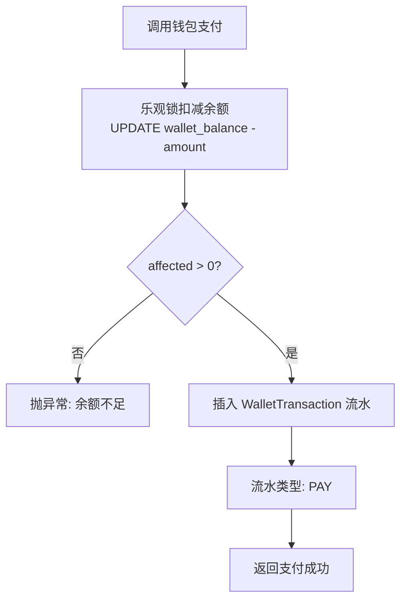

### 设计亮点
- 钱包余额直接存 User 表，避免多表 Join；流水单独存 WalletTransaction 表保证可追溯。
- 支付使用 `WHERE wallet_balance >= amount` 乐观锁，防止余额扣成负数。

### 核心代码

**支付（乐观锁防余额扣成负数）**
```java
public void pay(Long userId, String orderNo, BigDecimal amount) {
    BigDecimal before = user.getWalletBalance();
    if (before.compareTo(amount) < 0) {
        throw new BusinessException(ResultCode.BIZ_ERROR, "余额不足");
    }
    BigDecimal after = before.subtract(amount);

    int affected = userMapper.update(null,
        new LambdaUpdateWrapper<User>()
            .eq(User::getId, userId)
            .ge(User::getWalletBalance, amount)   // 乐观锁
            .set(User::getWalletBalance, after)
    );
    if (affected == 0) {
        throw new BusinessException(ResultCode.BIZ_ERROR, "余额不足或支付失败");
    }

    WalletTransaction tx = new WalletTransaction();
    tx.setUserId(userId);
    tx.setOrderNo(orderNo);
    tx.setType("PAY");
    tx.setAmount(amount);
    tx.setBalanceBefore(before);
    tx.setBalanceAfter(after);
    tx.setRemark("余额支付");
    walletTransactionMapper.insert(tx);
}
```

---

## 10. 收藏 (Favorite)

### 核心思路
用户收藏图书，Redis 缓存 + DB 双写。

### 关键流程
- **收藏**：查重后插入，Redis Set 同步添加 bookId。
- **取消收藏**：逻辑删除，Redis Set 同步移除。
- **是否已收藏**：先查 Redis，缓存穿透时回查 DB。
- **列表**：批量查询图书和分类信息组装 VO。

### 核心代码

**Redis Set 双写 + DB 兜底**
```java
public void addFavorite(Long userId, Long bookId) {
    favoriteMapper.insert(f);
    try {
        RSet<Long> set = redissonClient.getSet("favorite:user:" + userId);
        set.add(bookId);
    } catch (Exception e) {
        log.warn("Redis favorite add failed", e);
    }
}

public boolean isFavorited(Long userId, Long bookId) {
    try {
        RSet<Long> set = redissonClient.getSet("favorite:user:" + userId);
        if (set.contains(bookId)) return true;
    } catch (Exception e) {
        log.warn("Redis favorite check failed, fallback to DB", e);
    }
    // 缓存穿透回查 DB
    return favoriteMapper.selectCount(
        new LambdaQueryWrapper<Favorite>()
            .eq(Favorite::getUserId, userId)
            .eq(Favorite::getBookId, bookId)
            .eq(Favorite::getDeleted, 0)
    ) > 0;
}
```

---

## 11. 评价 (Review)

### 核心思路
订单完成后用户可对图书评价，评价后自动更新图书平均分。

### 关键流程
- **创建评价**：校验订单已完成 -> 校验订单包含该图书 -> 防重复评价 -> 校验图片路径合法性（必须 `reviews/{userId}/` 开头）。
- **图书评分更新**：评价提交/删除后，重新计算该图书所有评价的平均分，更新 `Book.rating`。
- **列表**：按图书分页查询评价，展示用户昵称和头像。

---

## 12. AI 智能助手 (AI Chat)

### 核心思路
基于大模型 API（通义千问）的图书导购对话系统，带 RAG（检索增强生成）。

### 对话流程
1. 获取或创建会话（无 sessionId 时自动创建，标题取首条消息前 30 字）。
2. 保存用户消息到数据库。
3. **RAG 检索**：根据用户消息关键词，从图书库检索最多 6 本候选图书（不足时补充热销图书）。
4. 构建系统 Prompt + 图书目录上下文 + 历史对话 + 当前消息，调用 AI API。
5. 保存 AI 回复，解析回复中引用的图书（通过书名匹配），关联到消息记录。
6. 更新会话最后消息和时间。

### AI 对话流程图
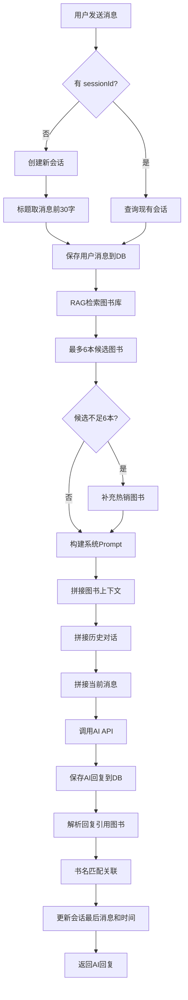

### 会话管理
- 支持创建、重命名、删除、分页列出会话。
- 历史消息限制（默认最近 10 条）控制 Token 消耗。

### 核心代码

**RAG 检索 + Prompt 构建**
```java
private List<Book> retrieveBookCandidates(String message, int limit) {
    Set<Long> ids = new LinkedHashSet<>();
    List<Book> result = new ArrayList<>();
    if (hasText(message)) {
        String kw = message.trim().length() > 12 
            ? message.trim().substring(0, 12) : message.trim();
        List<Book> matches = bookMapper.selectList(
            new LambdaQueryWrapper<Book>()
                .eq(Book::getStatus, 1)
                .eq(Book::getDeleted, 0)
                .and(w -> w.like(Book::getTitle, kw)
                    .or().like(Book::getAuthor, kw)
                    .or().like(Book::getDescription, kw))
                .orderByDesc(Book::getSalesCount)
                .last("LIMIT " + limit)
        );
        for (Book b : matches) {
            if (ids.add(b.getId())) result.add(b);
        }
    }
    // 候选不足时补充热销图书
    if (result.size() < limit) {
        int remaining = limit - result.size();
        List<Book> hot = bookMapper.selectList(
            new LambdaQueryWrapper<Book>()
                .eq(Book::getStatus, 1)
                .eq(Book::getDeleted, 0)
                .notIn(!ids.isEmpty(), Book::getId, ids)
                .orderByDesc(Book::getSalesCount)
                .last("LIMIT " + remaining)
        );
        for (Book b : hot) {
            if (ids.add(b.getId())) result.add(b);
        }
    }
    return result;
}

private String buildContextSnippet(List<Book> books) {
    StringBuilder sb = new StringBuilder();
    int idx = 1;
    for (Book b : books) {
        sb.append(idx++).append(". 《").append(b.getTitle()).append("》");
        if (b.getPrice() != null) sb.append(" 价格:¥").append(b.getPrice());
        sb.append('\n');
    }
    return sb.toString();
}
```

---

## 13. 签到 (Checkin)

### 核心思路
每日签到奖励，连续签到有额外奖励。

### 签到流程
1. Redisson 分布式锁防止并发重复签到（3 秒等待，5 秒租约）。
2. Redis 缓存校验今日是否已签到（26 小时 TTL）。
3. 查昨天是否签到 -> 是则连续天数 +1，否则重置为 1。
4. 查签到奖励规则表，是否有对应连续天数的额外奖励。
5. 基础奖励 0.10 元 + 额外奖励 = 总奖励。
6. 插入签到记录，增加用户钱包余额，记录 CHECKIN 流水。
7. 设置 Redis 今日已签到标记。

### 签到流程图
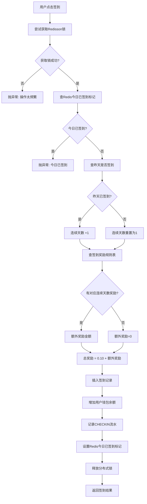

### 状态查询
- 今日是否已签到（先查 Redis，穿透查 DB）。
- 当前连续签到天数。
- 本月已签到日期列表（用于日历展示）。
- 明日预计奖励金额。

### 核心代码

**分布式锁 + Redis 缓存防重复**
```java
public CheckinResultVO checkin(Long userId) {
    LocalDate today = LocalDate.now();
    String lockKey = "checkin:lock:" + userId + ":" + today;
    RLock lock = redissonClient.getLock(lockKey);

    boolean locked = false;
    try {
        locked = lock.tryLock(3, 5, TimeUnit.SECONDS);
    } catch (InterruptedException e) {
        Thread.currentThread().interrupt();
        throw new BusinessException(ResultCode.SERVER_ERROR, "操作被中断");
    }
    if (!locked) {
        throw new BusinessException(ResultCode.BIZ_ERROR, "操作过于频繁");
    }

    try {
        // Redis 缓存校验
        String cacheKey = "checkin:today:" + userId;
        String cached = stringRedisTemplate.opsForValue().get(cacheKey);
        if ("1".equals(cached)) {
            throw new BusinessException(ResultCode.BIZ_ERROR, "今日已签到");
        }

        // 连续天数计算
        UserCheckin lastCheckin = userCheckinMapper.selectLatestByUser(userId);
        int consecutive = 1;
        if (lastCheckin != null 
            && lastCheckin.getCheckinDate().equals(today.minusDays(1))) {
            consecutive = lastCheckin.getConsecutiveDays() + 1;
        }

        // 奖励规则匹配
        BigDecimal reward = new BigDecimal("0.10");
        CheckinRewardRule bonusRule = rewardRuleMapper.selectOne(
            new LambdaQueryWrapper<CheckinRewardRule>()
                .eq(CheckinRewardRule::getConsecutiveDays, consecutive)
        );
        if (bonusRule != null) {
            reward = reward.add(bonusRule.getRewardAmount());
        }

        // 插入记录 + 增加钱包余额
        userCheckinMapper.insert(record);
        userMapper.update(null,
            new LambdaUpdateWrapper<User>()
                .eq(User::getId, userId)
                .setSql("wallet_balance = COALESCE(wallet_balance, 0) + " + reward)
        );

        // 设置 Redis 标记（26小时 TTL）
        stringRedisTemplate.opsForValue().set(cacheKey, "1", Duration.ofHours(26));
        return new CheckinResultVO(true, consecutive, reward, today);
    } finally {
        if (lock.isHeldByCurrentThread()) lock.unlock();
    }
}
```

## 14. 管理员后台 (Admin)

### 14.1 数据统计 (AdminStats)

#### 核心思路
聚合多个维度的运营数据。

| 指标 | 来源 |
|------|------|
| 总用户数 / 今日新增 | User 表 |
| 总图书数 / 在售图书数 | Book 表 |
| 订单数 / 今日订单数 | OrderMain 表 |
| 总收入 / 今日收入 | 已支付订单的 payAmount |
| 订单状态分布 | 遍历所有订单统计 |
| 热销 Top N | Book.salesCount 排序 |
| 近 7 天销售趋势 | 按支付日期分组聚合 |
| 进行中的秒杀/优惠券活动数 | 各活动表 |

### 14.2 图书封面上传 (AdminBookCover)

#### 核心思路
批量将本地目录图片上传到 OSS，并随机分配给图书做封面。

1. 遍历本地图片目录，按文件名排序。
2. 每张图片上传到 OSS `covers/` 目录。
3. 将所有图书按 ID 取模分组（如 10 张图则分 10 组）。
4. 每组图书设置相同的封面 key。

---

## 15. OSS 文件上传

### 核心思路
使用阿里云 OSS + STS 临时凭证，前端直传。

### 关键流程
- **STS 临时凭证**：后台调用阿里云 AssumeRole，生成限时的 AccessKey/Secret/Token，Policy 限制只能上传到指定用户目录。
- **上传目录**：
  - 头像：`avatars/{userId}/`
  - 图书封面：`covers/`
  - 评价图片：`reviews/{userId}/`
- **服务端上传**：管理员后台直接调用 OSS SDK 上传。
- **头像上传**：限制 2MB，仅允许图片类型。

---

## 16. 操作日志 (OperationLog)

### 核心思路
基于 AOP 的后台操作审计。

### 关键流程
- 使用 `@OperationLog` 注解标注需要记录的操作方法。
- `OperationLogAspect` 拦截方法，提取操作人、资源类型、操作类型、变更前后的数据。
- **异步写入**：通过 `@Async("taskExecutor")` 避免阻塞主业务流程。
- 后台可按资源类型、操作类型、管理员、时间范围查询日志。

---

## 17. 搜索历史 (SearchHistory)

### 核心思路
基于 AOP 自动记录用户搜索关键词。

### 关键流程
- 使用 `@SearchHistory(type = "TEXT")` 注解标注搜索方法。
- `SearchHistoryAspect` 拦截并保存搜索关键词。
- 用户可查看最近 N 条搜索历史，可一键清空。

---

## 18. 图书推荐 (BookRecommendation)

### 核心思路
基于用户行为的内容推荐。

### 18.1 个性化推荐 (recommendForUser)
1. 收集用户交互过的图书 ID（收藏 + 已支付订单中的图书）。
2. 分析用户偏好的分类（从交互图书中提取分类 ID）。
3. 从偏好分类中筛选高评分、高销量的图书（排除已交互过的）。
4. 若数量不足，补充热销图书。

### 18.2 相似图书 (similarBooks)
1. 同分类高评分图书。
2. 同作者图书。
3. 热销图书补充。

### 个性化推荐流程图
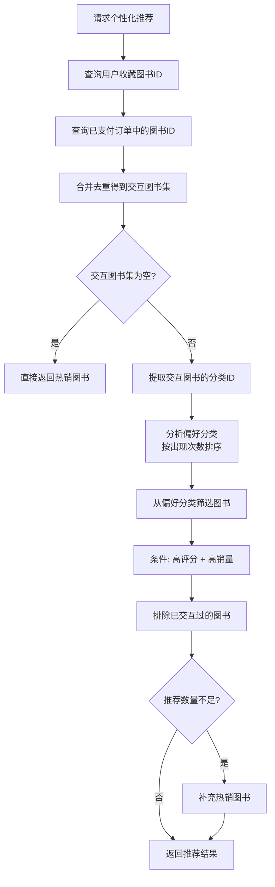

---

## 19. Token 黑名单 (TokenBlacklist)

### 核心思路
Redis 存储已撤销的 Token。

- key: `blacklist:{jti}`
- value: `1`
- TTL: Token 剩余有效期（精确到期自动删除，不永久占用内存）
- 刷新 Token 时校验：若 jti 在黑名单中则拒绝

---

*文档生成时间: 2026-05-24*
